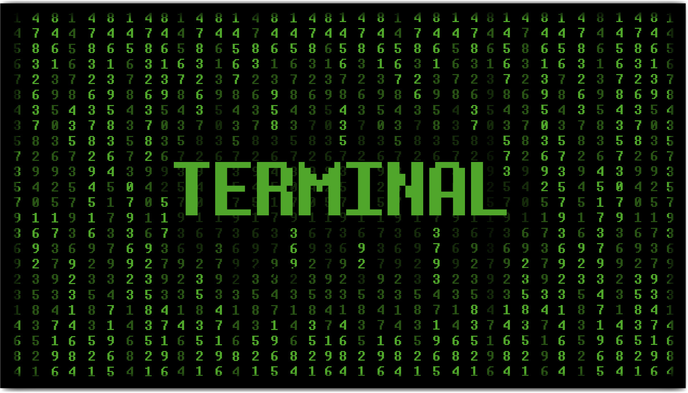
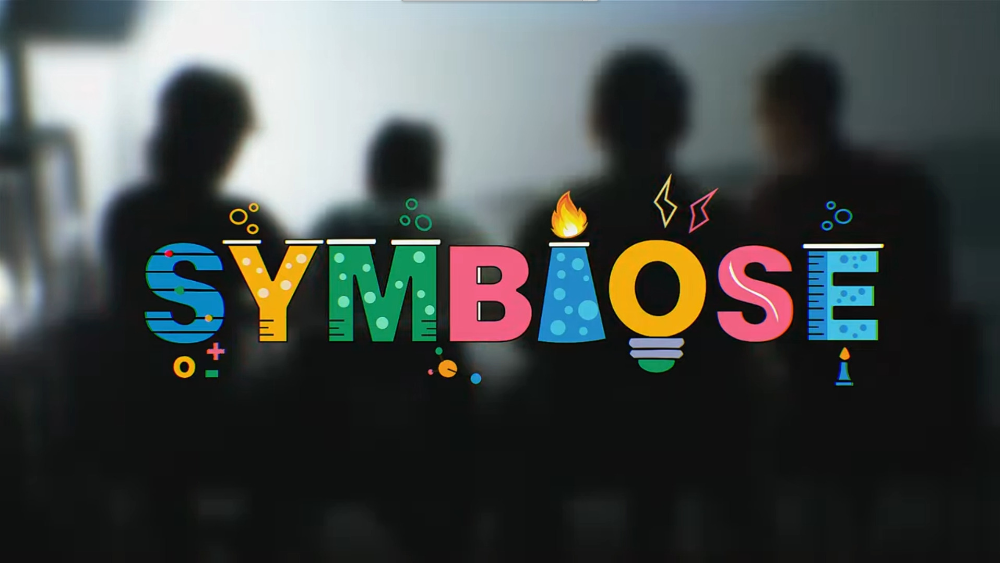
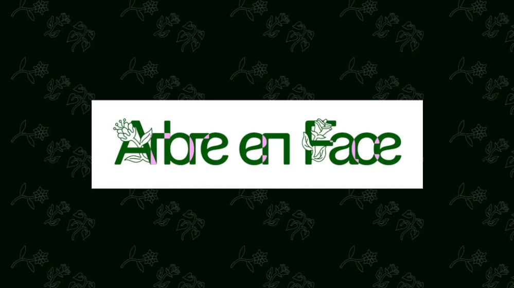
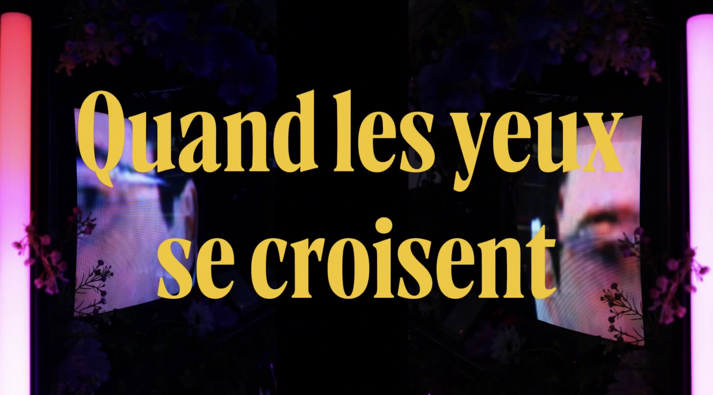
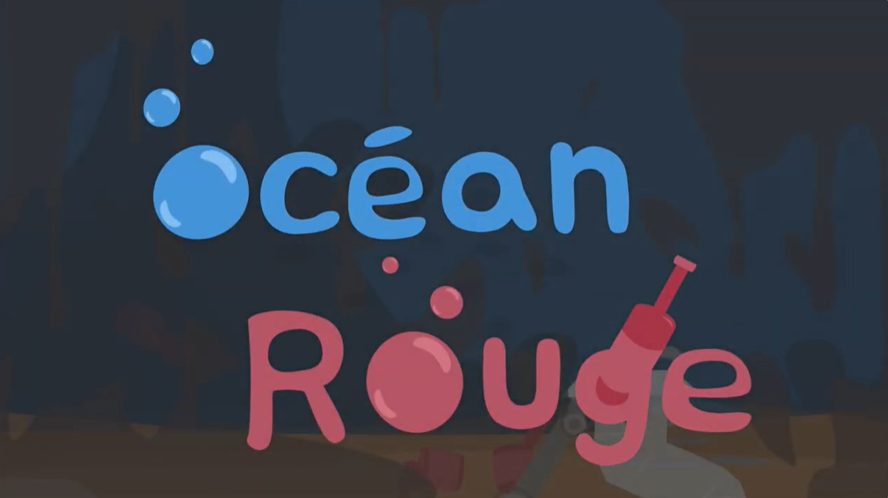

# Ordre de préférence #

1. O.I.G.N.O.N (mission décollage)
2. Terminal
3. Symbiose
4. Quand les yeux se croisent
5. Océan Rouge
6. Arbre en Face

 

# Réseau Vivant #

## Créateurs et Créatrices ##

### Terminal ###

- Émeryk Bélisle
- Elie Daher
- Ting Yung Lu Terry
- Dana Saavedra-Torrano
- Mégane Ranger

 

### Mission Décollage ###

- Ahmed Kaissoumi
- Radhouane Kordan
- Justin Montpetit
- Thearylou Lach
- Jad Saloumi

 

### Symbiose ###

- Yannick Chamberland
- Benjamin Ferland
- Ryan Dufault
- Walid Cheour

 

### Arbre en Face ###

- Alexandre Gendron
- Mikael Arseneau
- Mathieu Willett
- Matis Ghariani
- Rafael Angon Dubé

 

### Quand les yeux se croisent ###

- Edelwyn Ledru
- Félix Lavoie
- Jade Hébert
- Manel Yaya
- Patricia Nassif

 

### Océan Rouge ###

- Amira Tounekti
- Kristy Moussally

