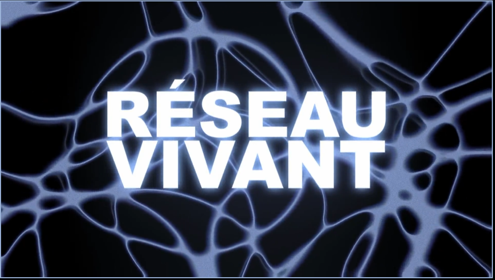
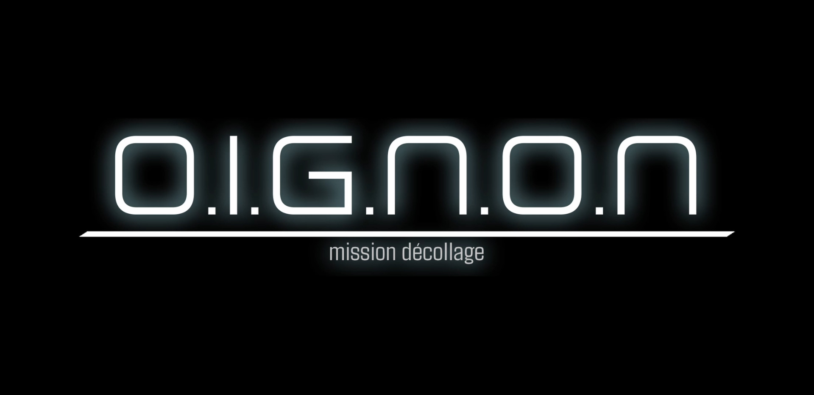

# Réseau Vivant #

### Lieu de mise en exposition ###
Dans le grand studio au Collège Montmorency.

 

### Type d'expostion ###
C'est une exposition temporaire crée par les finissants encandrant leur projet final du programme de technique d'intégration multimédia du collège Montmorency.

 

### Date de Visite ###
17 mars 2026.

  

# [O.I.G.N.O.N. (mission décollage)](https://o-i-g-n-o-n.github.io/Mission-decollage/#/) #

### Réalisé par : ###
- Ahmed Kaissoumi 
- Radhouane Kordan ( [LinkedIn](https://www.linkedin.com/in/radhouane-kordan/?original_referer=https%3A%2F%2Fo-i-g-n-o-n.github.io%2F) | [Portfolio](https://rad8433.github.io/portfolio-radhouane-kordan/) )
- justin Montpetit ( [linkedIn](https://www.linkedin.com/in/justin-montpetit-924574397/) | [Portfolio](https://babouin-sibyllin.github.io/portfolio-Justin-Montpetit/) )
- Thearylou Lach ( [Portfolio](https://thearyl.github.io/portfolio-thearylou-lach/) )
- Jad Saloumi. ( [LinkedIn](https://www.linkedin.com/in/saloumijad/?original_referer=https%3A%2F%2Fo-i-g-n-o-n.github.io%2F) | [Portfolio](https://jad2087.github.io/portfolio-jad-saloumi/) )

 

### Année de réalisation ###
2026

 

### Description de l'oeuvre ###

Mission Décollage est une expérience coopérative pour 1 à 3 joueurs où tous se tiennent devant un panneau de contrôle rempli de boutons et d’interrupteurs afin de gérer les systèmes vitaux de la fusée, comme les propulseurs, le bouclier, la propulsion, le système de boost et d’autres mécanismes essentiels, dans une coordination parfaite, car rien ne peut fonctionner sans travail d’équipe. L’aventure commence lorsqu’un joueur appuie sur un bouton, lançant ainsi la première mission habitée vers une planète nouvellement découverte et potentiellement habitable, avec l’objectif d’y établir une présence humaine. Tout au long du voyage dans l’espace, les joueurs doivent esquiver les météorites, ajuster la trajectoire et maintenir la fusée opérationnelle pour atteindre leur destination et réussir l’atterrissage. Chaque décision compte : pour survivre et accomplir leur mission, ils devront communiquer efficacement, réagir rapidement et se faire confiance afin d’arriver sains et saufs et marquer l’histoire de l’exploration spatiale. 🚀

> tiré du site web de l'oeuvre : [O.I.G.N.O.N.](https://o-i-g-n-o-n.github.io/Mission-decollage/#/)

