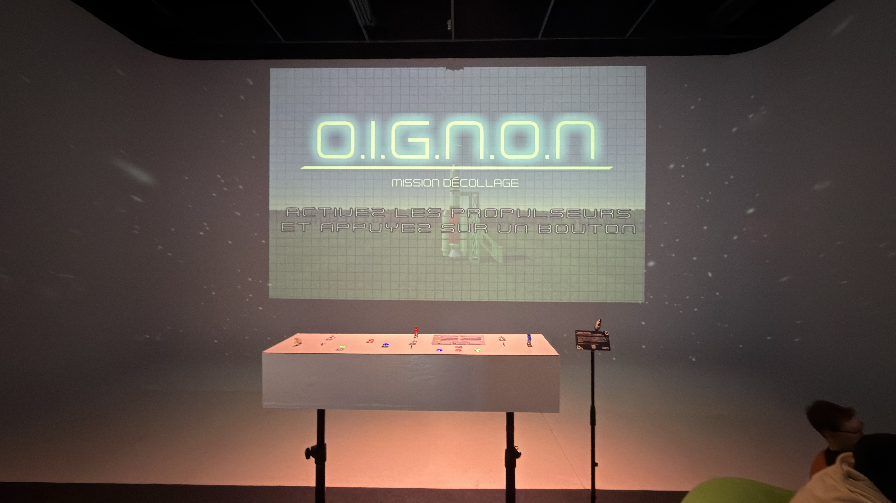
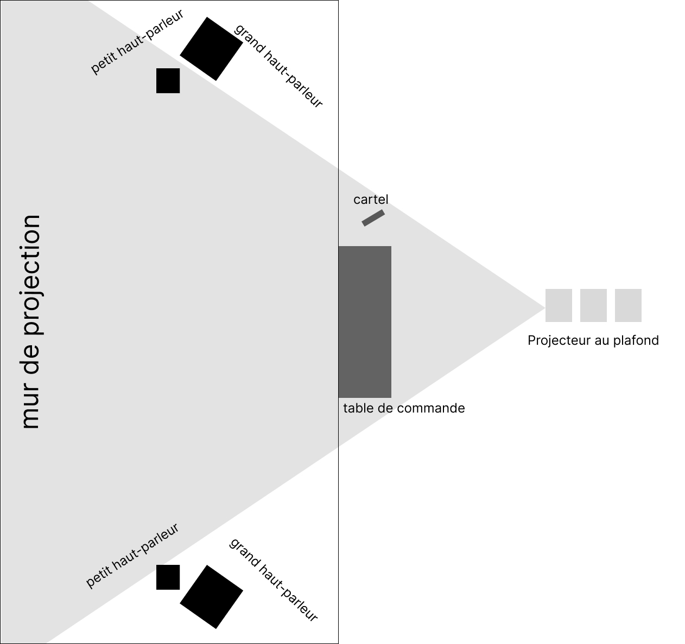
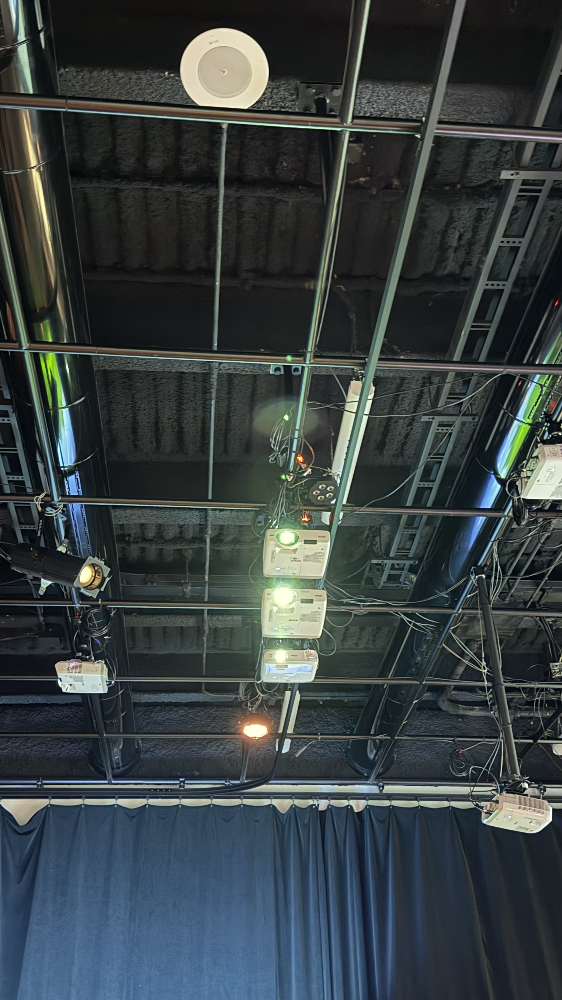
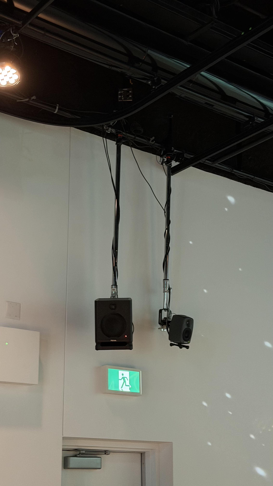
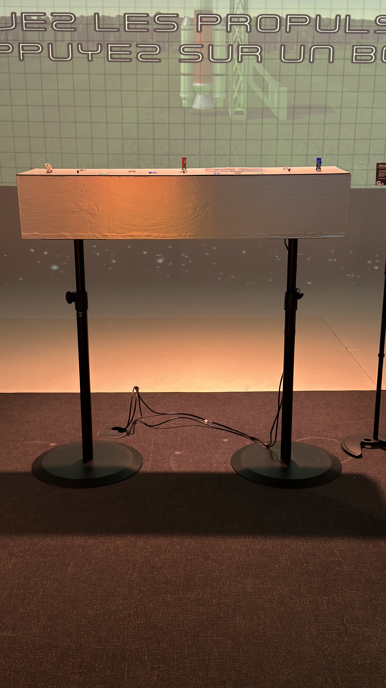

# Réseau Vivant #

### Lieu de mise en exposition ###
Dans le grand studio au Collège Montmorency.

 

### Type d'expostion ###
C'est une exposition temporaire crée par les finissants encandrant leur projet final du programme de technique d'intégration multimédia du collège Montmorency.

 

### Date de Visite ###
17 mars 2026.

  

# [O.I.G.N.O.N. (mission décollage)](https://o-i-g-n-o-n.github.io/Mission-decollage/#/) #

> O.I.G.N.O.N., exposition de Réseau vivant, 2026, photo par: ARB

### Réalisé par : ###
- Ahmed Kaissoumi 
- Radhouane Kordan ( [LinkedIn](https://www.linkedin.com/in/radhouane-kordan/?original_referer=https%3A%2F%2Fo-i-g-n-o-n.github.io%2F) | [Portfolio](https://rad8433.github.io/portfolio-radhouane-kordan/) )
- justin Montpetit ( [linkedIn](https://www.linkedin.com/in/justin-montpetit-924574397/) | [Portfolio](https://babouin-sibyllin.github.io/portfolio-Justin-Montpetit/) )
- Thearylou Lach ( [Portfolio](https://thearyl.github.io/portfolio-thearylou-lach/) )
- Jad Saloumi. ( [LinkedIn](https://www.linkedin.com/in/saloumijad/?original_referer=https%3A%2F%2Fo-i-g-n-o-n.github.io%2F) | [Portfolio](https://jad2087.github.io/portfolio-jad-saloumi/) )

 

### Année de réalisation ###
2026

 

### Description de l'oeuvre ###

> cartel de O.I.G.N.O.N., exposition de Réseau vivant, 2026, photo par: ARB

### Type d'installation ###

> O.I.G.N.O.N., exposition de Réseau vivant, 2026, photo par: ARB

C'est une installation interactive ou deux personne doivent prendre controle d'un vaisseau spatiale et pouvoir essayer d'arriver sur mars sans se faire détruire par les météorites.

### Mise en espace ###

### Composantes et techniques ###

**Équipements**

- Ordinateur – x1
Utilité : Lancer le jeu, uploader le code sur les arduinos, lancer PureData, lancer OBS

- Epson PowerLite 990U Projector – x1
Utilité : Projeter au cyclorama le jeu

- Epson PowerLite 535W Projector – x2
Utilité : Projeter l'ambiance sur le cyclorama

- Haut-parleur - x2 Utilité : Diffusion du son

- Carte son Behringer UMC202HD - x1 Utilié : Transmettre le son aux haut-parleurs

- Câble XLR - 4x Utilité : Connecter la carte son à l'haut-parleur

- Contrôleur Arduino M5Stack ATOM Lite ESP32 – x2
Utilité : Recevoir et transmettre la base du code aux autres logiciels (PureData, Unity)

- Contrôleur Arduino mini – x3
Utilité : Recevoir et transmettre du code pour les composantes du tableau de bord

- [PBHUB] I/O Hub 1 to 6 Expansion Unit (MEGA328) – x1
Utilité : Étendre le nombre de composants à utiliser Justification du nombre : Un par station pour avoir une proximité avec les autres composants et nous laisser une marge pour les composants futurs

- [GROVEHUB] I/O Hub 1 to 3 Expansion Unit – x1
Utilité : Étendre le nombre de composants à utiliser Justification du nombre : Un par station pour avoir une proximité avec les autres composants et nous laisser une marge pour les composants futurs

- Encodeur – x3
Utilité : Reçoit les rotations du joueur et les transmet au contrôleur. Contrôle les fumées de côtés de la fusée.

- BOUTON POUSSOIR (MOMENTARY) – x6
Utilité : Reçoit les pressions du joueur et les transmet au contrôleur. Permet de remplir des objectifs / régler des problèmes

- CÂBLE ETHERNET – x12
Utilité : Deux câbles Ethernet sont utilisés pour connecter le projecteur et l’ordinateur à la salle Matrice, et un autre câble Ethernet relie le transmitter au receiver afin d’afficher le contenu du PC sur le projecteur.

- SWITCH ETHERNET – x1
Utilité : Avoir plusieurs port Ethernet disponible pour connecter au tableau de bord

- TOGGLE SWITCH (SAFETY) - x3 Utilité: Améliorer l'expérience en ajoutant différentes composantes, autre que des boutons. Servent à activer/désactiver les réacteurs

- ROTARY SWITCH - x3 Utilité: Améliorer l'expérience en ajoutant différentes composantes, autre que des boutons. Servent à activer le lancement de la fusée / remplir des objectifs / régler des problèmes

- FADERS - x3 Utilité: Reçoit la position du fader attribué par le joueur. Permet de contrôler la puissance des réacteurs.

- UNIT 3.96 - x12 Utilité: Permet de gérer 2 inputs par composants.

 

**Logiciels**

- Unity
Création du projet, des menus et du jeu
Gestion des scènes
Réception et traitement de l’OSC avec l’extension extOSC disponible sur l’Asset Store

- Pure Data
Gestion de l’OSC et traitement et transfert des données reçus du contrôleur arduino sur Unity

- Visual Studio Code & PlatformIO
Développement et programmation sur le contrôleur arduino

- Maya / Blender
Création des assets 3D et de leurs animations nécessaires au jeu

- OBS
Utilisation pour la projection du jeu et de l'ambiance

- Photoshop & Illustrator
Création des assets 2D
Design des interfaces et éléments graphiques

- Reaper
Conception sonore & modification des sons de notre banque de son

- Langages de programmation
C# (Unity)
C++ (Arduino)

> Les composantes ont été tirés du site web de l'exposition : [Techniques du projet](https://o-i-g-n-o-n.github.io/Mission-decollage/#/technique/?id=%c3%89quipements)

  

### Éléments nécessaires ###

> projecteurs de O.I.G.N.O.N., exposition de Réseau vivant, 2026, photo par: ARB

> haut-parleurs de O.I.G.N.O.N., exposition de Réseau vivant, 2026, photo par: ARB

> table de commande de O.I.G.N.O.N., exposition de Réseau vivant, 2026, photo par: ARB

Les éléments nécessaires à la mise en exposition sont : un mur, des projecteurs, des haut-parleurs, une table de commande, un ordinateur.

  

### Expérience vécue ###

> table de commande de O.I.G.N.O.N., exposition de Réseau vivant, 2026, photo par: ARB

L'expérience que j'ai vécu c'était que c'était vraiment le fun à essayer d'arriver sur mars sans se faire détruire. En plus, qu'on doit le faire en équipe et être dépendant de chacun pour réussir c'est très intéressant et cool comme idée de dispositif.

 

Ce qui m'a plu c'était tout les techniques sur la table qui correspond et controle le jeu.

