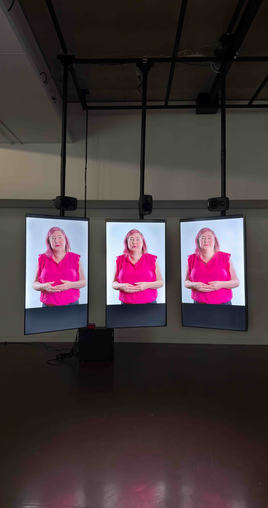
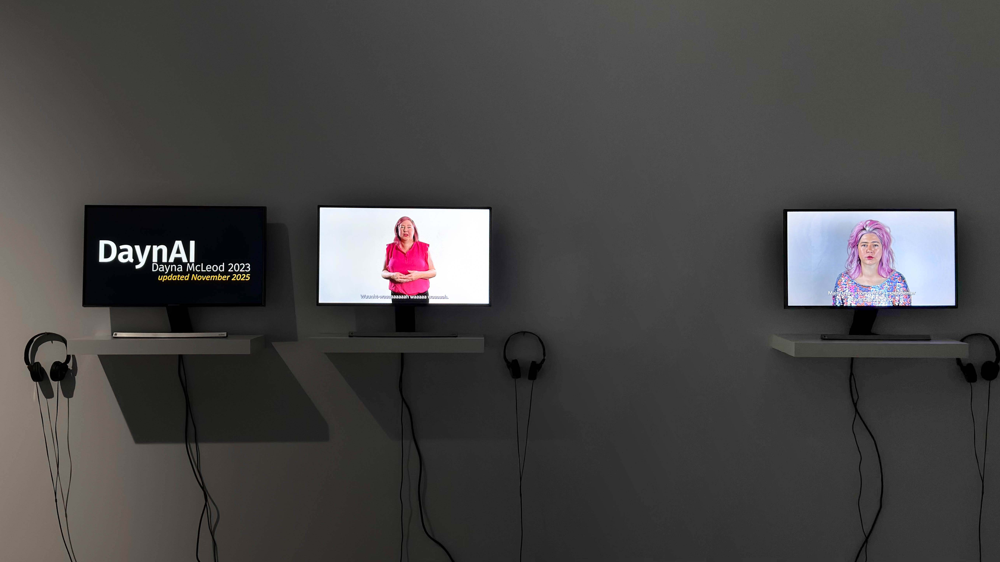

# Devenirs partagés. Pratiques de l'IA #

## Affiche de l'exposition ##

 

>Affiche de l'exposition, Devenirs partagés. Pratiques de l'IA, Montréal, Janvier 2026, Photo ARB.

## Lieu de mise en exposition ##

 

>Lieu de l'exposition, Galerie de l'Université de Montréal, Montréal, Janvier 2026, Photo ARB.

---

## Description de l'exposition ##

[*Devenirs partagés. Pratiques de l'IA*](https://galerie.umontreal.ca/devenirs-partagees-pratiques-de-lia.php) [^1] est une exposition temporaire intérieure qui va du 28 novembre 2025 jusqu'au 28 février 2026.

J'ai fait ma visite à cette exposition le 30 janvier 2026.

## Description de l'oeuvre ##

L'œuvre que j'ai choisie est celle de l'artiste Dayna McLeod et a été créée en 2025: [*Queer, Widow, Cancer*](https://daynarama.com/queer-widow-cancer/) [^2]

Le projet présenté par Dayna McLeod est une œuvre autobiographique et expérimentale qui explore la maladie, le deuil et la souffrance à travers l’utilisation de l’intelligence artificielle. L’artiste crée plusieurs avatars numériques d’elle-même afin de prolonger son récit personnel et de transmettre son expérience par des entités algorithmiques capables de parler et de performer à sa place. L’installation cherche à tester les possibilités de l’IA à exprimer des émotions humaines complexes comme l’empathie, la mémoire et la douleur, tout en révélant les limites de cette imitation technologique. Le projet met ainsi en tension l’identité humaine et sa reproduction artificielle, en questionnant l’idée qu’une machine puisse réellement incarner une expérience vécue.

Les composantes et techniques dont a besoin cette œuvre sont : des moniteurs de télévision et support, haut-parleurs et casques, vidéo numérique IA.

 

>Cartel de la présentation de l'oeuvre, Queer, Widow, Cancer, Montréal, Janvier 2026, Photo ARB.

---

## Type d'installation ##

L'installation de McLeod est principalement contemplative et immersive, car tu réfléchis à ce qu'elle dit et aussi tu dois utiliser les écouteurs pour écouter.

Cette installation multimédia est principalement contemplative et immersive. Elle présente plusieurs écrans disposés dans l’espace, diffusant des vidéos en boucle d’une même personne sous différentes formes. Certains écrans sont accompagnés de haut-parleurs directionnels et d’écouteurs, ce qui oblige le visiteur à se déplacer et à se rapprocher pour entendre le contenu, créant une expérience sonore intime et ciblée. La scénographie répartit les dispositifs sur les murs et suspend de grands écrans verticaux, ce qui structure le parcours et attire l’attention sur certaines images plus dominantes. L’œuvre est immersive par son environnement audiovisuel et contemplative, car le spectateur observe et écoute sans modifier le contenu. Le dispositif sert à la fois à la mise en valeur du témoignage présenté et à la mise en contexte du propos personnel de l’artiste.

 

>Vue d'ensemble de la disposition de l'oeuvre, Queer, Widow, Cancer, Montréal, Janvier 2026, Photo ARB.

---

## Mise en espace ##

La mise en espace de cette installation repose sur une répartition claire et structurée des dispositifs vidéo et audio dans la salle. Les écrans sont disposés sur deux zones principales : un mur avec de plus petits moniteurs posés sur des tablettes, chacun accompagné d’écouteurs, et un autre mur avec de grands écrans verticaux suspendus. Les grands écrans attirent d’abord le regard, tandis que les petits écrans invitent à une approche plus intime. L’espace central reste dégagé, permettant la circulation libre du visiteur et un recul pour observer l’ensemble. Les dispositifs sonores, haut-parleurs directionnels et casques, obligent à se rapprocher physiquement des œuvres, ce qui transforme le déplacement du spectateur en partie intégrante de l’expérience. L’éclairage neutre et l’environnement épuré mettent l’accent sur les images et les voix, renforçant la concentration et l’immersion.

 

>Croquis de la mise en espace, Queer, Widow, Cancer, Montréal, Janvier 2026, Photo ARB.

Dans le croquis on peut voir l'installation des écrans verticals, les 3 écrans sur le murs, les écouteurs et les casques.

--- 

## Composantes et techniques ##

  

 

>Vue d'ensemble des composantes pour l'exposition, Queer, Widow, Cancer, Montréal, Janvier 2026, Photo ARB.

## Éléments nécessaires ##

Les éléments nécessaires pour la mise en exposition sont : une grille au plafond pour tenir les supports et les moniteurs, un ordinateur pour pouvoir projeter l'image sur les moniteurs, des écouteurs, des casques audios, des câbles pour connecter le tout et un mur pour tenir les écrans qui sont sur le mur.

---

## Expérience vécue ##

Pour l'expérience vécue, on commence devant les 3 écrans qui flottent et il faut se placer proche pour pouvoir bien écouter ce que les personnages disent dans les vidéos.  

 

>Photo du parcours de l'expérience de l'oeuvre, Queer, Widow, Cancer, Montréal, Janvier 2026, Photo ARB.

Ensuite, il faut passer au mur à gauche et passer un à la fois chaque écran, puis mettre les casques et écouter chaque vidéo courte.

 

>Photo du parcours de l'expérience de l'oeuvre, Queer, Widow, Cancer, Montréal, Janvier 2026, Photo ARB.

--- 

## Appréciation ##

Ce que j'ai aimé de l'exposition, c'est que l'artiste mélangeait des aspects de sa vie qui peuvent être difficiles et lourds comme sujet avec l'humour qu'elle réalise avec l'aide de l'intelligence artificielle De plus, j'ai ressenti beaucoup d'émotions quand elle parlait de sa vie après la mort de sa femme et quelque personne peut même s'identifier avec ses histoires.

---

## Aspect que je ne retiendrai pas ##

Un aspect que je pense que je ne retiendrai pas, c'est la voix faite par l'IA. Je veux dire, comme elle voulait que ça soit plus drôle et humoristique, mais je pense que moi je voudrais une voix plus réaliste et qui peut attacher plus au spectateur.

[^1]: Lien vers la page de l'exposition, *Devenirs Partagés, Pratique de l'IA*, consulté le 6 février 2026.
[^2]: Lien vers la page de Dayna McLeod et la présentation de l'œuvre, consulté le 6 février 2026.

