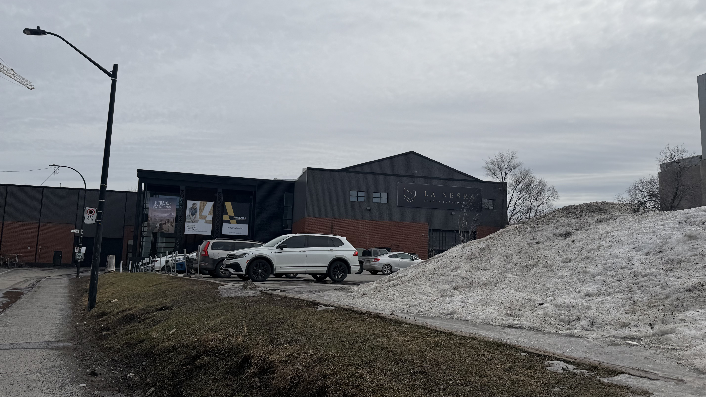
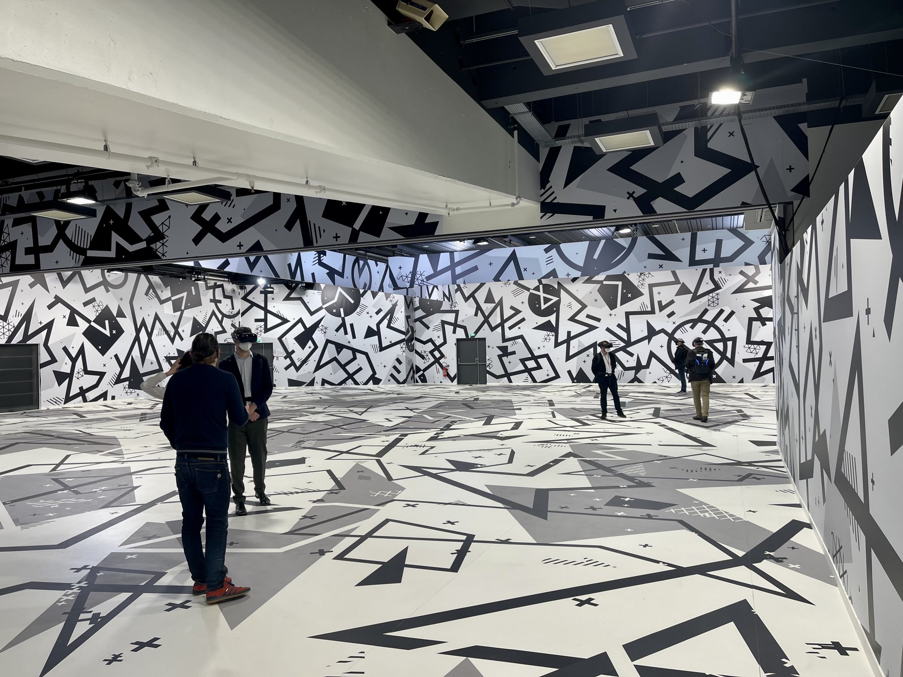
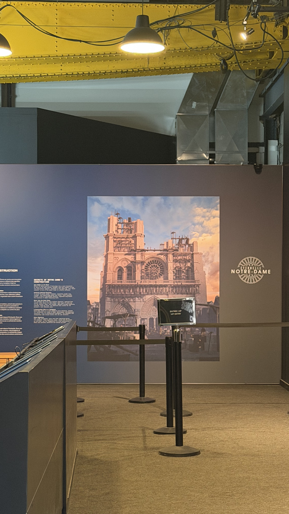
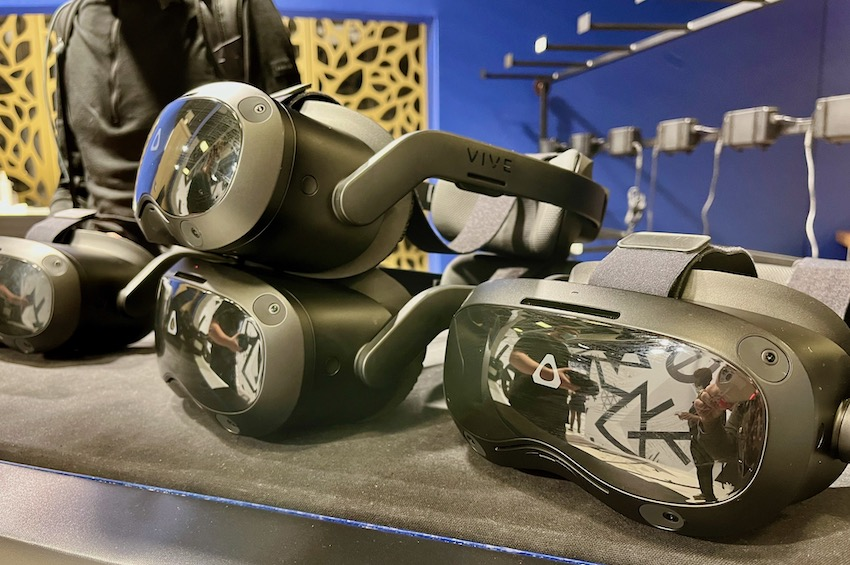
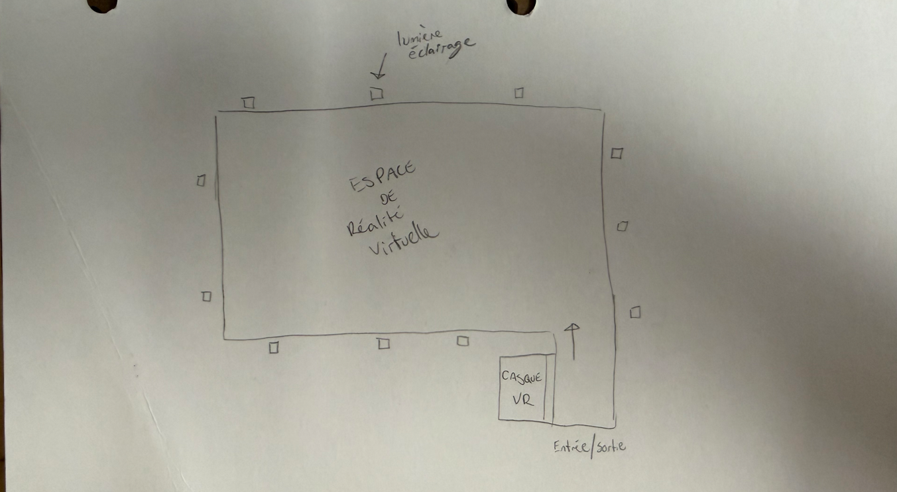
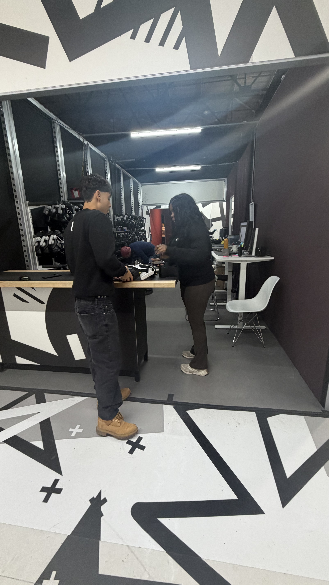
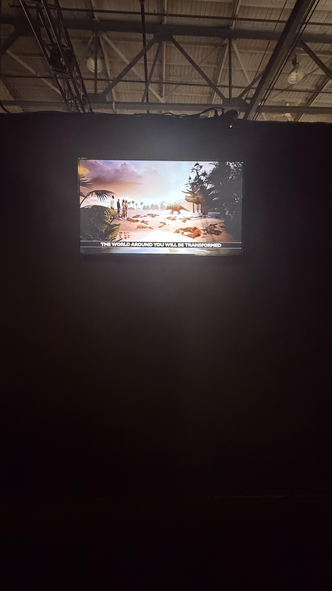
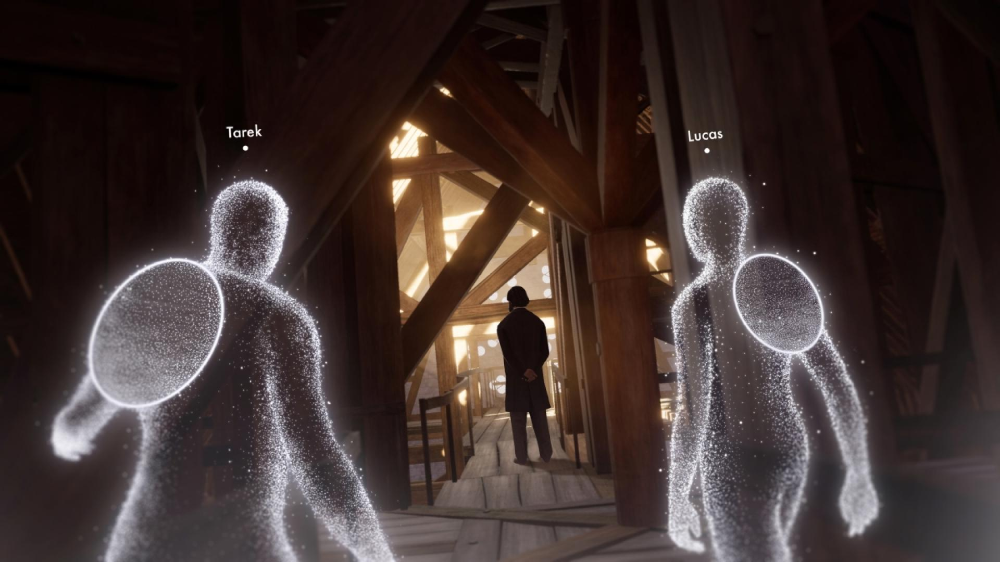

# Arsenal art contemporain #

> Logo du lieu d'exposition, Arsenal art contemporain, Logo Pierre et Anne-Marie Trahan, 2011

 

# Lieu d'exposition #

> Lieu de l'exposition de l'oeuvre, Montréal, photo par ARB, 2026

 

# Type d'exposition #

Temporaire : du 29 janvier au 26 septembre 2026

 

# Date de ma visite #

J'ai fait ma visite à l'exposition lundi le 9 mars 2026

 

# Éternelle Notre-Dame #

> Photo de la vue d'ensemble de l'oeuvre, France, photo par (https://casques-vr.com/eternelle-notre-dame-de-paris-une-visite-de-40-minutes-en-realite-virtuelle-20290/), 2022

 

## Nom de la firme ##

La firme qui a réalisé ce projet se nomme Excurio qui est un studio français.

 

## Année de réalisation ##

Le projet à été réalisé en 2022.

 

## Description de l'oeuvre ##

> photo du cartel de l'oeuvre, Montréal, photo par ARB, 2026

 

Éternelle Notre-Dame est une expérience immersive en réalité virtuelle qui plonge les visiteurs dans l'histoire et la restauration de la cathédrale Notre-Dame de Paris.

## Type d'installation ##

Le type d'installation est immersive en réalité virtuelle.

> Photo des casques utilisés pour la réalité virtuelle, photo par Emmanuela Registre, 2022

## Fonction du dispositif multimédia ##

Les visiteurs sont équipés d'un casque VR immersif qui reproduit l'intérieur, l'extérieur et les abords de Notre-Dame de Paris en modèle numérique. le dispositif comprend également un grand espace sécurisé où chaque mouvement du participant est traduit dans l'environnement virtuel, permettant une exploration libre et interactive de la cathédrale. De plus, l'expérience peut accueuillir plusieurs visiteurs en même temps, chaque participant voyant les autres sous forme d'avatar et pouvant interagir avec eux dans l'espace virtuel.

 

## Mise en espace ##

> photo du croquis de l'oeuvre, Montréal, photo par ARB, 2026

 

## Composantes et techniques ##

> photo des composantes, Montréal, photo par ARB, 2026

- Casque de réalité virtuelle
- Récit de 45 minutes
- Technologie de pointe

 

## Élément nécessaires ##

> photo de la salle d'exposition, Montréal, photo par ARB, 2026

Il est nécessaire d'avoir un grand bâtiment, avec un espace très ouvert pour pouvoir se promener.

 

## Expérience vécue ##

Premièrement, je rentre il y a un mur avec un écran qui explique les consignes.

> photo de l'expérience vécu, Montréal, photo par ARB, 2026

Ensuite, je passe au comptoir pour mettre mon casque de VR.

> photo des composantes, Montréal, photo par ARB, 2026

Après ça je rentre dans le monde VR.

> photo dans l'oeuvre, photo par Éternelle Notre-Dame, 2026

L'expérience dure un environ de 45 minutes.

## Appréciation ##

J'aimais beaucoup la qualité du VR et comment il pouvait vraiment nous faire transporter dans l'ancien temps. Aussi, que l'expérience se sentait vraiment réel, même qu'il y a eu des moments de vertiges.

  

### Sources ###

- https://eternelle-notre-dame.ca/
- https://www.mtl.org/fr/quoi-faire/festivals-et-evenements/eternelle-notre-dame
- https://casques-vr.com/eternelle-notre-dame-de-paris-une-visite-de-40-minutes-en-realite-virtuelle-20290/
- https://jobetudiant.net/teste-pour-vous-lexperience-notre-dame-immersive/
- https://www.themayor.eu/en/a/gallery/discover-notre-dame-cathedral-with-immersive-vr-experience-9751?item=2

