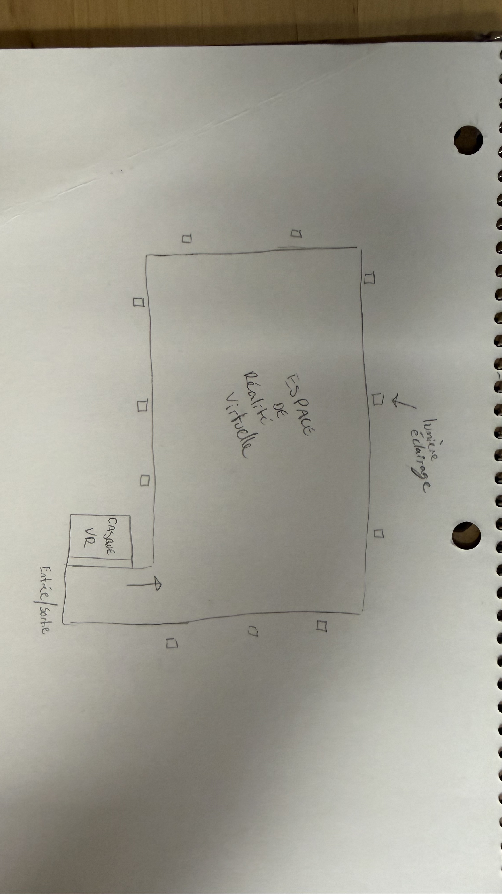

# Arsenal art contemporain #

> Logo du lieu d'exposition, Arsenal art contemporain, Logo Pierre et Anne-Marie Trahan, 2011

 

# Lieu d'exposition #

> Lieu de l'exposition de l'oeuvre, Montréal, photo par ARB, 2026

 

# Type d'exposition #

 

# Date de ma visite #

J'ai fait ma visite à l'exposition lundi le 9 mars 2026

 

# Éternelle Notre-Dame #

> Photo de la vue d'ensemble de l'oeuvre, France, photo par (https://casques-vr.com/eternelle-notre-dame-de-paris-une-visite-de-40-minutes-en-realite-virtuelle-20290/), 2022

 

## Nom de la firme ##

La firme qui a réalisé ce projet se nomme Excurio qui est un studio français.

 

## Année de réalisation ##

Le projet à été réalisé en 2022.

 

## Description de l'oeuvre ##

> photo du cartel de l'oeuvre, Montréal, photo par ARB, 2026

 

Éternelle Notre-Dame est une expérience immersive en réalité virtuelle qui plonge les visiteurs dans l'histoire et la restauration de la cathédrale Notre-Dame de Paris.

## Type d'installation ##

Le type d'installation est immersive en réalité virtuelle.

> Photo des casques utilisés pour la réalité virtuelle, photo par Emmanuela Registre, 2022

## Fonction du dispositif multimédia ##

Les visiteurs sont équipés d'un casque VR immersif qui reproduit l'intérieur, l'extérieur et les abords de Notre-Dame de Paris en modèle numérique. le dispositif comprend également un grand espace sécurisé où chaque mouvement du participant est traduit dans l'environnement virtuel, permettant une exploration libre et interactive de la cathédrale. De plus, l'expérience peut accueuillir plusieurs visiteurs en même temps, chaque participant voyant les autres sous forme d'avatar et pouvant interagir avec eux dans l'espace virtuel.

 

## Mise en espace ##

