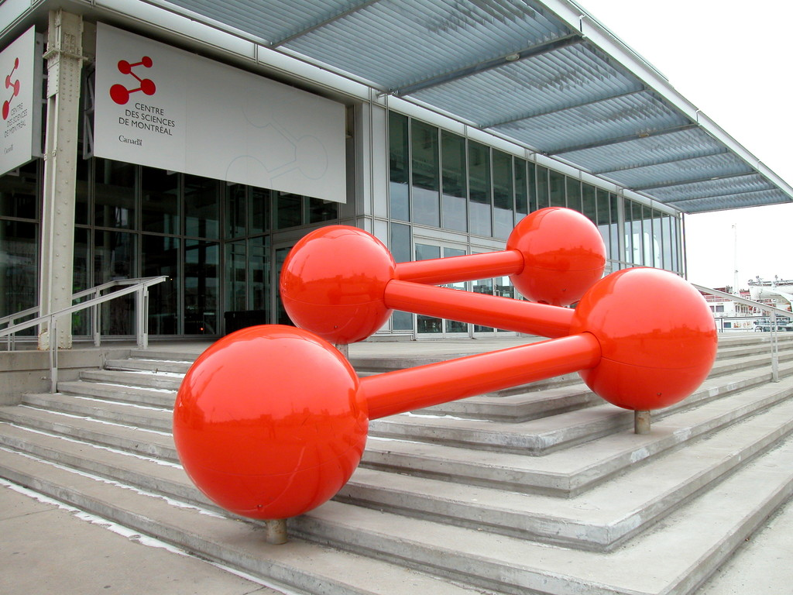
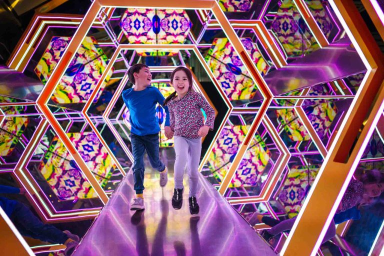

# Centre des Sciences #

> Logo du Centre des sciences

## Lieu de mise en exposition ##

> Photo devant le centre des science, Photo par : Denis Chabot, [photo](https://monde.ccdmd.qc.ca/ressource/?id=30173&demande=desc)

### Type d'exposition ###

c'est une exposition permanente

### Date de visite ###

1er avril 2026

# Jeux de réflexion #

> photo du dispositif du jeu de réflexion, Photo par: Benoit Rousseau, [photo](https://courrierlaval.com/une-relache-animee-au-vieux-port/)

### Nom de la firme ###

Le dispositif fait partie de l’exposition Explore, conçue par l’équipe interne du Centre des sciences de Montréal.

### Année de réalisation ###

Exposition Explore inaugurée vers 2000.

### Description de l’œuvre ou du dispositif ###

Lumière : jeux de réflexion est un dispositif interactif qui permet aux visiteurs d’expérimenter les propriétés de la lumière, notamment la réflexion, la réfraction et les illusions visuelles. À travers différents modules comme des miroirs, un kaléidoscope géant et des surfaces lumineuses, le visiteur manipule des sources lumineuses et observe leurs effets. L’installation met en évidence le comportement de la lumière ainsi que les limites de la perception humaine.

### Type d'installation ###

Interactive et immersive

### Fonction du dispositif ###

Support pédagogique et mise en contexte scientifique.

### Mise en espace ###
